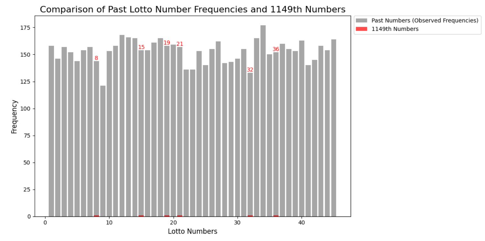

# Predicting Lotto Numbers with AI
This project applies various machine learning and deep learning techniques to predict lottery numbers based on historical data. Although lottery outcomes are inherently random, this project explores AI's ability to detect patterns and trends within the data.

---

## Introduction

This project predicts lotto numbers using machine learning techniques, including Random Forest, XGBoost, and Neural Networks. 

In addition to prediction, we have included **statistical analysis** to compare historical data and validate the occurrence patterns of winning numbers using Chi-square tests and Poisson probabilities.

---

## Goals

1. Develop machine learning models to predict lotto numbers based on historical data.
2. Perform **statistical analysis** to:
   - Identify patterns in historical lotto data.
   - Compare winning numbers with historical distributions using Chi-square tests.
   - Assess the likelihood of specific numbers appearing using Poisson probabilities.

---

## Project Overview
This project analyzes and predicts gas prices across Canada using MySQL for data storage and Python for data processing.
The workflow consists of:
  1. **Data Collection**:
     - Historical lottery data is collected via a public API and stored in CSV format for preprocessing and analysis.
    
  2. **Data Preprocessin**:
     - Data cleaning, normalization, and feature engineering are performed.
     - Dimensionality reduction techniques, including PCA, are applied for efficient feature selection.
       
  3. **Model Development**:
     - Multiple machine learning algorithms (e.g., Random Forest, XGBoost, KNN, SVM) and PCA-enhanced approaches.
     - Deep learning models (FCNN, LSTM).
     - Hybrid models combining CNN and LSTM for enhanced pattern recognition.

---

## Algorithms Used
### Machine Learning
  1. **Random Forest**:
     - A robust ensemble method applied to classify and predict lottery numbers.
     - Feature importance analysis was performed to understand predictors' significance.
       
  2. **XGBoost**:
     - A gradient boosting algorithm optimized for high performance.
     - Showed significant potential in handling complex data patterns.
       
  3. **K-Nearest Neighbors (KNN)**:
     - Applied to find patterns based on the proximity of historical data points.
     - Evaluated with different values of K for optimization.
       
  4. **Support Vector Machines (SVM)**:
     - Used to identify the hyperplane that separates lottery patterns effectively.
     - Kernel-based methods were tested to explore non-linear patterns.
       
  5. **Combined PCA + Random Forest**:
     - Principal Component Analysis (PCA) was used for dimensionality reduction before applying Random Forest.
     - Improved computational efficiency and reduced overfitting while maintaining performance.

---

### Deep Learning
  1. **Fully Connected Neural Networks (FCNN)**:
     - A feedforward architecture designed to model non-linear relationships in the data.
     - Features ReLU activation for hidden layers and Softmax for classification.
       
  2. **Long Short-Term Memory (LSTM)**:
     - Designed to capture temporal dependencies in sequential data.
     - Addressed challenges like vanishing gradients in time-series analysis.
       
  3. **Hybrid Model (CNN + LSTM)**:
     - Combines Convolutional Neural Networks (CNN) for spatial pattern extraction with LSTM for modeling sequential dependencies.
     - Achieved the best performance among all tested models.

---

## Key Results
  1. **Pattern Recognition**:
     - Models identified trends in historical data but struggled to predict exact outcomes due to randomness.
       
  2. **PCA + Random Forest**:
     - Highlighted key dataset components, improving model efficiency and interpretability.
       
  3. **Hybrid Model Performance**:
     - The CNN + LSTM model demonstrated the highest potential by correctly identifying one number (21) in the 1149th draw.

---

## Lessons Learned
  1. **Strengths and Limitations of AI**:
     - AI excels at recognizing patterns in structured data but faces challenges with purely random events.
       
  2. **Hybrid Models**:
     - Combining CNN and LSTM enhanced prediction capability, demonstrating the value of integrating spatial and temporal features.
       
  3. **Real-World Applications**:
     - While not suitable for lottery prediction, these techniques can be applied to problems like financial forecasting or inventory management.

---

## How to Run
  1. **Clone the repository**:
     - git clone https://github.com/joohyeok-seo/Predicting-Lotto-Numbers-with-AI.git
       
  2. **Install dependencies**:
     - pip install -r requirements.txt
       
  3. **Run the notebooks in sequence**:
     - lotto_api_to_csv.ipynb: Collect historical lottery data via API.
     - lotto_data_preprocessing.ipynb: Clean and preprocess data, apply PCA.
     - lotto_machine_learning.ipynb: Implement Random Forest, XGBoost, KNN, SVM, and PCA combinations.
     - lotto_deep_learning.ipynb: Build FCNN and LSTM models.
     - lotto_hybrid_model.ipynb: Develop and evaluate CNN + LSTM hybrid models.

---

## Statistical Analysis

To enhance the predictive analysis, this project includes statistical validation of lotto numbers using the following methods:

### 1. Chi-square Test
We performed a Chi-square test to compare the observed frequencies of lotto numbers in historical data with the 1149th winning numbers.

- **Chi-square Statistic**: 40.19
- **p-value**: 0.6357
- **Interpretation**: The p-value indicates no statistically significant difference between the historical distribution and the new numbers.

### 2. Poisson Probabilities
The probability of each winning number appearing was calculated using the Poisson distribution, based on the mean frequency of historical data.

#### Results:
| Number | Probability |
|--------|-------------|
| 8      | 0.0000000000 |
| 15     | 0.0000000000 |
| 19     | 0.0000000000 |
| 21     | 0.0000000000 |
| 32     | 0.0000000000 |
| 36     | 0.0000000000 |

**Interpretation**:
The extremely low probabilities indicate that the 1149th winning numbers are rare in the context of historical data, which is expected due to the randomness of lotto results.

### Visualization

The bar graph below compares the frequency of historical lotto numbers (gray) with the 1149th winning numbers (red):

---
## Future Directions
  1. Experiment with additional ensemble techniques for improved accuracy.
       
  2. Apply transfer learning for better feature extraction in hybrid models.
       
  3. Test the methodology on structured datasets with less inherent randomness.

---

## Acknowledgments
This project highlights the potential of AI in analyzing complex datasets, offering insights into both its capabilities and limitations when applied to unconventional problems like lottery number prediction.
